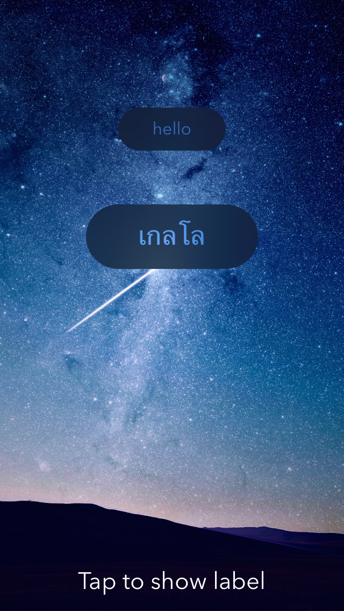

# SYNFadingLabel

[](http://cocoadocs.org/docsets/SYNFadingLabel)
[](http://cocoadocs.org/docsets/SYNFadingLabel)
[](http://cocoadocs.org/docsets/SYNFadingLabel)

## Screenshot


## Usage

To run the example project, clone the repo, and run `pod install` from the Example directory first.

-----
To use SYNFadingLabel, create a view in storyboard and set its class to `SYNFadingLabel`.

After creating an outlet, configure it like so:

```objc
self.fadingLabel.backgroundColor = [UIColor clearColor];
[self.fadingLabel configureWithFont:[UIFont fontWithName:@"AvenirNext-Regular" 
                               size:16] 
                          fadeDelay:2.5 
                       fadeDuration:0.3];
```

To make the label appear, just set its text:

```objc
[self.fadingLabel setText:@"page %@ / %@", curPage, totalPages];
```

The label will automatically fade away after the set delay.

-----

## Requirements

iOS 8 (UIVisualEffectsView)

## Installation

SYNFadingLabel is available through [CocoaPods](http://cocoapods.org). To install
it, simply add the following line to your Podfile:

    pod "SYNFadingLabel"

## Author

Sidhant Gandhi, sidhantg@syntertainment.com

## License

SYNFadingLabel is available under the MIT license. See the LICENSE file for more info.